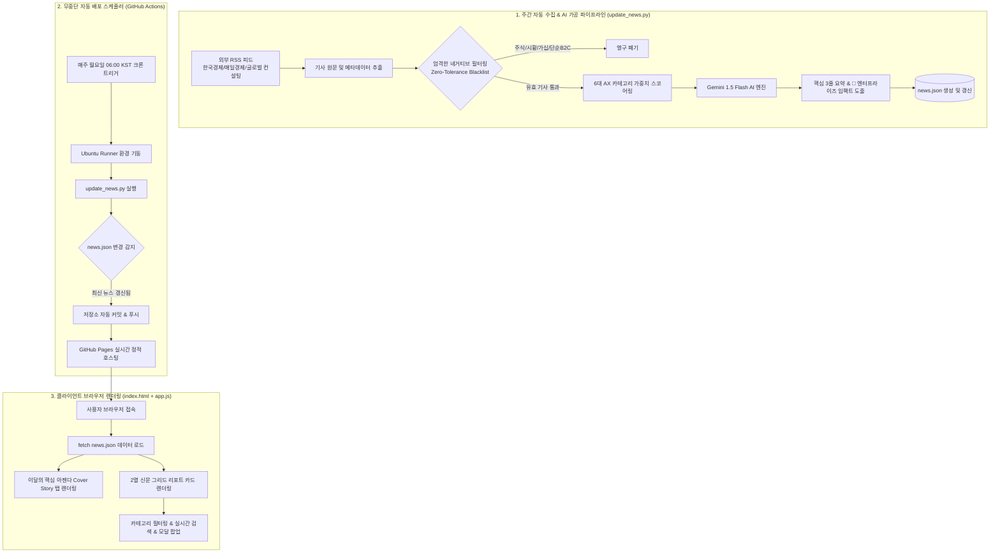

# 🏛️ AX 트렌드 리포트 (The AI · AX Chronicle) 시스템 아키텍처 및 로직 상세 명세서

본 문서는 **[AX 트렌드 리포트]**가 어떠한 기획 의도와 기술 스택으로 구축되었으며, 뉴스 수집·AI 요약·화면 렌더링·정기 자동 갱신이 어떤 구체적인 로직으로 동작하는지 상세히 기술한 공식 시스템 명세서입니다.

---

## 1. 프로젝트 개요 및 기획 의도

* **서비스 명칭**: The AI · AX Chronicle (AX 트렌드 리포트)
* **타깃 독자**: 기업 C-Level, 경영진, DX/AX 추진 실무 부서장, AI 기반 업무 생산성 혁신 담당자
* **핵심 가치**: 
  - 단순 가십성 IT 뉴스나 주가/시황 기사를 완전히 배제하고, **기업 단위의 실질적 AX 도입 사례, 비즈니스 임팩트(ROI), 일하는 방식의 변화**만을 엄선하여 전달.
* **디자인 콘셉트**:
  - Financial Times / The Economist 스타일의 **클래식 모던 브로드시트(Broadsheet) 신문 톤앤매너**.
  - 화려한 요소 대신 신뢰감을 주는 타이포그래피(Serif 헤드라인, 절제된 잉크 블랙 & 버건디 액센트), 2열 아티클 그리드 적용.
* **기술 원칙**: 
  - **Zero-Dependency (순수 Vanilla JS/HTML/CSS)**: 외부 프레임워크나 무거운 서버 없이 동작하여 **사내 폐쇄망(오프라인)에서도 100% 완벽 구동**.
  - **Zero-Cost (완전 무료 인프라)**: GitHub Actions + GitHub Pages를 활용하여 서버 비용 0원으로 24시간 365일 글로벌 서빙.

---

## 2. 전체 엔드투엔드 데이터 파이프라인 구조



---

## 3. 데이터 파이프라인 상세 로직 (`update_news.py`)

`update_news.py`는 수집부터 자연어 분석, JSON 출력까지 전 과정을 담당하는 파이썬 엔진입니다.

### ① 고정밀 RSS 수집 소스
* **국내 주요 경제지**: 한국경제(IT/테크, 산업), 매일경제(기업, 테크)
* **글로벌 싱크탱크 및 테크 피드**: AI 거버넌스, 엔터프라이즈 B2B 소식 피드

### ② 엄격한 3대 네거티브 블랙리스트 (Zero-Tolerance Blacklist)
비즈니스 가치가 없는 기사는 정규식(Regex)을 통해 1차로 원천 차단됩니다:
1. **주식/시황/투자/가상자산**: `주가`, `폭락`, `급등`, `목표주가`, `순매수`, `시가총액`, `코스피`, `나스닥`, `테마주`, `코인`, `환율` 등
2. **가십/클릭베이트/황색 언론**: `맘카페`, `불륜`, `사생활`, `발칵`, `경악`, `충격 고백`, `오열`, `연예인`, `누리꾼`, `악플` 등
3. **단순 B2C 가젯/이벤트**: `스마트폰 케이스`, `게임`, `웹툰`, `할인 쿠폰`, `사은품`, `경품` 등

### ③ 6대 카테고리 분류 및 가중치 스코어링
기사 제목과 본문을 분석하여 가장 적합한 카테고리로 자동 분류합니다:
* **🤖 자율 에이전트 (`agents`)**: 에이전틱, 오케스트레이션, MCP, 멀티 에이전트
* **💼 일하는 방식 변화 (`workplace`)**: 생산성, 업무 자동화, 코파일럿, 리스킬링, 워크플로우
* **🏭 산업별 현장 사례 (`industry`)**: 스마트팩토리, 제조, 의료/헬스케어, 금융, 물류, 피지컬 AI
* **⚖️ 거버넌스·규제 (`policy`)**: 보안, 데이터 유출 방지, 컴플라이언스, EU AI Act, 가드레일
* **⚡ 프론티어 기술 (`frontier`)**: 기업용 프라이빗 sLLM, 온프레미스, NPU/인프라, TCO 절감
* **🏢 기업·엔터프라이즈 AX (`enterprise`)**: 전사 AI 도입, ERP 결합, 레거시 연동, B2B 전환

### ④ Gemini 1.5 Flash AI 요약 및 비즈니스 임팩트 분석
* **API 연결**: Google Gemini API를 호출하여 구조화된 프롬프트를 전송합니다.
* **출력 포맷**:
  - **1줄 헤드라인 요약**: 바쁜 리더를 위한 핵심 요지
  - **3줄 불릿 요약**: 핵심 사실, 수치(%, 원, 시간), 추진 경과
  - **🎯 엔터프라이즈 비즈니스 임팩트**: "이 기사가 우리 기업의 비즈니스와 업무 방식에 주는 실질적 의미와 실천 과제(Actionable Takeaway)"를 도출
* **폴백(Fallback) 안전장치**: 만약 API 키가 없거나 네트워크가 차단되어도 시스템이 죽지 않고 정규식 기반의 문장 추출 폴백 로직이 작동하여 유효한 JSON을 생성합니다.

---

## 4. 프론트엔드 인터랙션 로직 (`index.html`, `styles.css`, `app.js`)

외부 라이브러리(React, Vue, jQuery 등)가 일절 없는 **Pure Vanilla Architecture**로 구축되었습니다.

### ① 데이터 흐름
1. `index.html` 로드 시 `app.js`의 `init()` 함수가 실행됩니다.
2. `fetch('news.json')`을 통해 데이터를 비동기로 로드합니다.
3. 데이터 검증 후 화면 상단의 **메타 정보(발행일자, 총 리포트 수)**를 갱신합니다.

### ② 이달의 핵심 아젠다 (Cover Story / Executive Agenda)
* 맥킨지, 딜로이트, PwC, 베인 등 글로벌 컨설팅 펌의 프레임워크를 기반으로 3대 핵심 아젠다를 탭 형태로 렌더링합니다.
* 탭 클릭 시 활성화 클래스(`active`)가 전환되며 해당 아젠다의 상세 진단, 핵심 실행 지침, 실전 사례 아티클 목록을 보여줍니다.

### ③ 신문 그리드 렌더링 & 실시간 인터랙션
* **카테고리 필터**: 6대 카테고리 칩 버튼 클릭 시 일치하는 기사만 필터링하여 재렌더링.
* **실시간 텍스트 검색**: 검색창 입력 시 제목, 요약, 비즈니스 임팩트, 태그를 실시간 검색(디바운스 적용).
* **기사 상세 모달(Modal)**: 기사 카드 클릭 시 팝업이 뜨며, AI 분석 리포트 전문 및 원문 링크를 제공.
* **인쇄(Print) 최적화 CSS**: 브라우저 인쇄(`Ctrl + P`) 시 불필요한 내비게이션과 버튼이 숨겨지고 A4 용지에 맞춘 인쇄용 신문 레이아웃으로 자동 전환됩니다.

---

## 5. 데이터 갱신 및 스케줄링 (`weekly_update.yml`)

매주 정기 업데이트는 GitHub 클라우드의 워크플로우를 통해 자동으로 일어납니다.

1. **실행 주기**: 매주 월요일 아침 06:00 (한국 시간 KST)
   - 크론 설정: `cron: '0 21 * * 0'` (UTC 일요일 21:00)
2. **수동 즉시 실행 지원**:
   - `workflow_dispatch` 설정이 포함되어 있어, GitHub 웹 화면의 `[Actions]` 탭에서 `[Run workflow]` 버튼을 누르면 언제든 즉시 새 뉴스를 긁어와 갱신할 수 있습니다.
3. **스마트 커밋**:
   - `update_news.py` 실행 후 `news.json`의 실제 변경 여부를 `git diff`로 확인하여, **새로운 뉴스가 있을 때만 깔끔하게 커밋 & 푸시**합니다.

---

## 6. 사내 클라우드 PC(오프라인)에서의 유지보수 가이드

### Q1. 화면에서 기사 내용을 직접 수정하거나 새 기사를 넣고 싶다면?
* `news.json` 파일을 열어 `articles` 목록에 아래 형식으로 객체를 추가/수정하고 저장하면 끝납니다:
```json
{
  "id": "custom-01",
  "title": "우리 회사 전사 사내 생성형 AI 도입 성과 보고",
  "source": "사내 DX추진단",
  "date": "2026.09.23",
  "category": "enterprise",
  "categoryLabel": "🏢 기업·엔터프라이즈 AX",
  "strategicTier": "tier1",
  "strategicBadge": "핵심 실전 사례",
  "summary": [
    "전 임직원 대상 생성형 AI 코파일럿 도입 3개월 차 분석",
    "반복 서류 작성 및 데이터 취합 시간 주당 평균 4.2시간 절감",
    "보안 유출 방지를 위한 프라이빗 게이트웨이 및 가드레일 가동 중"
  ],
  "impact": "실질적 ROI 검증이 완료 단계에 진입하였으며, 4분기부터는 부서별 맞춤형 에이전트 오케스트레이션으로 고도화 추진 필요.",
  "tags": ["사내사례", "생산성", "ROI", "거버넌스"],
  "url": "#"
}
```

### Q2. 사내 PC에서 디자인을 변경하고 싶다면?
* 폰트/색상 변경: `styles.css` 상단의 CSS 변수(`:root { --font-serif: ..., --accent-burgundy: ... }`)를 수정합니다.
* 레이아웃 변경: `index.html`을 수정합니다.
* 수정 후 브라우저 새로고침(`F5`)만 누르면 즉시 확인됩니다.
